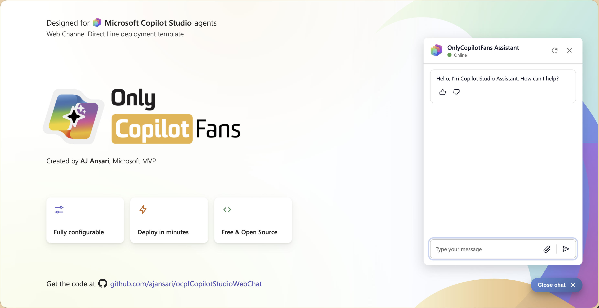
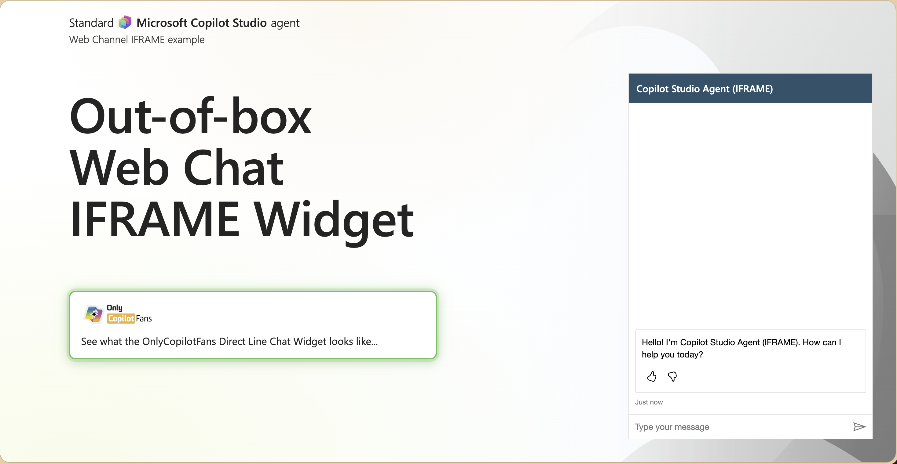

# OnlyCopilotFans Copilot Studio Direct Line Web Chat Widget


Created by **AJ Ansari**, Microsoft MVP. An [OnlyCopilotFans](https://OnlyCopilotFans.com) project.

An expand/collapse chat widget for a **Microsoft Copilot Studio** agent, built on
**Direct Line** with plain HTML, CSS and JavaScript. No framework, no build step, no backend.
Works with classic experience agents (standard harness); see
[Agent requirements](#agent-requirements) for the current status of new experience agents.
Drop it on any website, or on WordPress. The chat window opens as a floating window in the
corner, as a full-height sidecar docked to the right edge (the way Copilot opens in Edge and
the Office apps), or as a fullscreen chat; one setting switches between them.

**Live demo:** <https://ajansari.github.io/ocpfCopilotStudioWebChat/webchat-widget/index.html>

| The widget on the demo page | Copilot Studio's own IFRAME embed, for comparison |
|---|---|
|  |  |

## Three ways to get started

**1. Try it, then download a package (easiest).**
Open the [interactive demo](https://ajansari.github.io/ocpfCopilotStudioWebChat/webchat-widget/index-interactive.html)
and press **Customize, Try It & Get Your Package**. A side pane lets you change every setting
(title, placeholder, icon, colours, display mode and window size, launcher style, text size,
position, file uploads, feedback buttons) and press **Try It** to see the result live. Paste your own agent's Direct Line
secret to chat with your agent instead of the demo one. When it looks right, press
**Download package**: you get a zip with the widget files, a `config.js` filled in with your
values, your icon, `EMBED.html` with the code to paste into your page, an `example.html` test
page, and a README that covers a plain web page, another page of your site, and WordPress.
The zip is built in your browser; nothing is uploaded anywhere.

**2. Embed by hand.** Copy the widget block out of `index.html`, link `chat-widget.css`, add
the four script tags, fill in `config.js`. Step by step in
[`EMBEDDING_INSTRUCTIONS.md`](webchat-widget/EMBEDDING_INSTRUCTIONS.md), including a WordPress
child-theme recipe.

**3. Run the demo locally.**

```bash
cd webchat-widget
cp config.sample.js config.js      # then paste your Direct Line secret(s) into config.js
python3 -m http.server 8080
```

Open `http://localhost:8080` and click the launcher in the bottom-right corner.
`index-interactive.html` is the customizer; `IframeVersion.html` shows Copilot Studio's own
IFRAME chat for comparison.

## What you get

- Floating launcher button in five styles (icon + label, icon only, label only, compact)
  and an expandable chat window with a restart button.
- Three display modes for the chat window: **floating** (a window next to the launcher),
  **sidecar** (docked to the right edge, full height, any width in px or %, stretchable by
  dragging its edge, optionally pushing the page content aside) and **fullscreen** (the
  whole browser window, or a width and height in px or %, centred over a dimmed page).
  The X in the title bar can be switched off, and the window can open on page load.
- Markdown replies, citations with source links, suggested-action buttons, typing indicator.
- File uploads (paperclip) and thumbs up / down feedback, each switchable, when the agent
  supports them.
- Everything configurable from one file, `config.js`: title, placeholder, icon, button colour,
  message box colour, display mode and window size, launcher style, labels and corner
  (bottom-right or top-right), font size, offset from the corner, feature toggles, secrets.
- Widget styles scoped to the widget, so it does not restyle the page it lands on, and it
  always renders in Segoe UI with a self-hosted fallback.
- Responsive: desktop, iPad landscape and portrait, and phones.
- Secret 1 with automatic fallback to Secret 2, so you can rotate secrets without downtime.

## Agent requirements

> **Which agents work (as of October 8, 2026):** Copilot Studio now has two agent runtimes,
> which Microsoft calls *harnesses*. This widget uses **Direct Line**, and Direct Line is
> currently offered only for **classic experience agents (standard harness)**. **New
> experience agents (GitHub Copilot harness)** list the Direct Line channel as "not currently
> available": the secret is accepted and the widget shows *Online*, but no greeting or replies
> ever arrive. Microsoft's channel table for the new harness lists only the demo website and
> the iframe embed as available today, so use the iframe (see `IframeVersion.html`) for those
> agents. Direct Line support for the new harness is expected to follow; check
> [Microsoft's channel availability page](https://learn.microsoft.com/en-us/microsoft-copilot-studio/agents-experience/publication-channels-overview)
> for the current status.

The agent must allow unauthenticated Direct Line access. In Copilot Studio open the agent and
go to **Settings > Security**: set **Authentication** to *No authentication*, then open
**Web channel security** and copy **Secret 1** (and optionally **Secret 2**). Publish the
agent after changing either setting.

On that same page, **Require secured access** is recommended but optional. The widget works
either way, because it always sends a secret. Leaving it off means the agent also answers
anonymous Direct Line calls that carry no secret, so switch it on unless you have a reason
not to.

File uploads and feedback buttons also need their agent-side switches: **Settings > Generative
AI**, *File uploads* and *Collect user reactions to agent messages*. Publish again afterwards.

## What's in `webchat-widget/`

| File | Purpose | Needed on your site? |
|---|---|---|
| `app.js` | Chat logic: Direct Line connection, messages, uploads, feedback | Yes |
| `chat-widget.css` | All widget styles, scoped to the widget, with the font rules | Yes |
| `config.js` | Your settings and Direct Line secrets (start from `config.sample.js`) | Yes |
| `images/chat-icon.png` | Launcher and title-bar icon, 136 × 136 px | Yes, or your own |
| `fonts/` | Selawik fallback fonts, used if Microsoft's font CDN is unreachable | Yes |
| `index.html` | Demo page plus the widget markup block to copy | Copy the block only |
| `index-interactive.html`, `interactive.js`, `interactive.css` | Interactive customizer and package builder | No |
| `IframeVersion.html` | The demo page with Copilot Studio's IFRAME chat, for comparison | No |
| `styles.css` | Demo page styles only | No |
| `config.sample.js` | Template for `config.js` | No |
| `CONFIGURATION.md` | Every setting explained, colours, icon, troubleshooting | No |
| `EMBEDDING_INSTRUCTIONS.md` | Embedding on a static site or WordPress, step by step | No |
| `DEPLOYMENT.md` | Hosting, replicating for more agents, troubleshooting | No |

## Security note

`config.js` ships the Direct Line secret to the browser. That is fine for demos, internal
sites and low-risk agents. For a public production site, move token generation to a small
backend you control and keep the secret there; `DEPLOYMENT.md` §5C describes the pattern.
Whichever way you go, use the agent's own Copilot Studio settings to decide what it may do.

## License

This project is licensed under the **[PolyForm Shield License 1.0.0](https://polyformproject.org/licenses/shield/1.0.0)**
(see [LICENSE](LICENSE)). It is a **source-available** license, not an open source license, and
in practice that means:

- **Free to use.** There is nothing to buy and no registration.
- **The source is available.** Every file in this repository is here to read, run, and adapt.
- **Build what you like with it.** Put the widget on your own sites or your clients' sites, free
  or commercial. The sites and agents you build are yours; the license says nothing about them.
- **The one reservation** is the license's noncompete: you may not use this project to provide a
  product that competes with it, or with a product its licensor provides using it, for example by
  repackaging it as your own chat widget product.

Copyright © 2026 AnsariCo, Inc. dba [OnlyCopilotFans](https://OnlyCopilotFans.com) and
[OnlyBCFans](https://OnlyBCFans.com).
