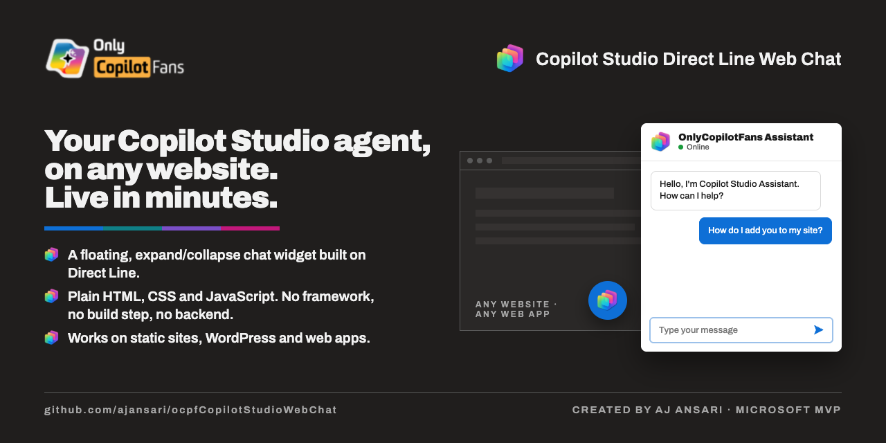

# OnlyCopilotFans Copilot Studio Direct Line Web Channel Chat Widget



Created by **AJ Ansari**, Microsoft MVP — an [OnlyCopilotFans](https://github.com/ajansari) project.

A floating, expand/collapse web chat widget for a **Microsoft Copilot Studio** agent, built
on **Direct Line** with plain HTML, CSS and JavaScript — no framework, no build step, no
backend. Drop it on any website.

Everything lives in [`webchat-widget/`](webchat-widget/).

**Full setup guide: [`webchat-widget/CONFIGURATION.md`](webchat-widget/CONFIGURATION.md)**
(embedding, `config.js` reference, icon, colours, launcher styles, file uploads, feedback,
troubleshooting).

## Quick Start

1. Open the `webchat-widget` folder.
2. Copy `config.sample.js` to `config.js` and set your Direct Line secret(s) — see below.
3. Start a local static server from that folder:

```bash
cd webchat-widget
python3 -m http.server 8080
```

4. Visit `http://localhost:8080`.
5. Click the chat launcher in the bottom-right corner and start chatting.
   `IframeVersion.html` shows the same page with Copilot Studio's own iframe chat, for comparison.

## What's in `webchat-widget/`

- `index.html` - placeholder page + floating chat widget markup (between START/END markers)
- `IframeVersion.html` - same page using the Copilot Studio iframe web chat instead
- `styles.css` - page styles + all widget styles (light theme, blue accent)
- `app.js` - Direct Line connection/chat logic
- `config.js` - your settings + Direct Line secrets
- `config.sample.js` - template for `config.js`
- `images/` - chat icon (required) + placeholder-page images
- `fonts/` - Selawik fallback fonts (required)
- `CONFIGURATION.md` - full settings and embedding manual
- `EMBEDDING_INSTRUCTIONS.md` - step-by-step embedding (static HTML, WordPress)
- `DEPLOYMENT.md` - deployment and replication guide

## New Agent Setup (Fast)

In `webchat-widget/config.js` set:

- `directLine.primarySecret`
- `directLine.secondarySecret` (optional fallback)
- `chatTitle` (chat window title)
- `inputPlaceholder` (message box placeholder)
- `launcherIconUrl` (image path, see [`webchat-widget/images/README.md`](webchat-widget/images/README.md))
- `launcherColor`, `launcherStyle`, launcher labels, offsets, `fontSizeAdjust`, `fileUploads`,
  `feedbackButtons` — see [`CONFIGURATION.md` §3](webchat-widget/CONFIGURATION.md)

## Important Security Note

`config.js` puts the Direct Line secret in browser-delivered code. That's fine for demos and
internal sites; for production/public hosting, move token creation to a backend service and
keep secrets server-side (see `CONFIGURATION.md` §3).

## License

Free and open source under the [MIT License](LICENSE).
Copyright (c) 2026 OnlyCopilotFans and AJ Ansari.
